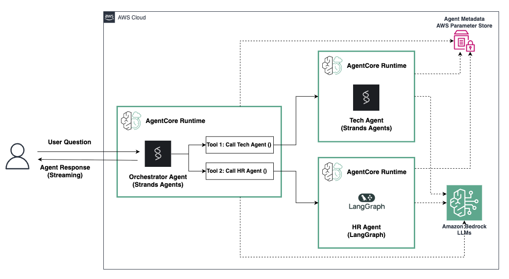

# Distributed Multi-agent Solution using Amazon Bedrock AgentCore

## Overview

In this tutorial we will learn how to independently host agents each in their own Bedrock AgentCore Runtime and built with different Agentic Frameworks. We'll then enable communication between them for a distributed multi-agent solution. 

In this example we'll create:
1. A technical agent (tech_agent) that is specialized in answering technical questions about programming and tech troubleshooting.
2. A HR agent (hr_agent) that is specialized in company benefits.
3. An orchestrator agent (orchestrator_agent) that routes questions to the technical or HR agent.

Putting these three agents together you get a multi-agent configuration with a supervisor, which can route user questions to the appropriate subagent. This system is capable of answering a range of questions an employee might have at a company.

## Tutorial Details

| Information         | Details                                                                          |
|:--------------------|:---------------------------------------------------------------------------------|
| Tutorial type       | Conversational                                                                   |
| Agent type          | Multi-Agent (Supervisor calling agents as tools)                                 |
| Agentic Framework   | Strands Agents & LangGraph                                                       |
| LLM model           | Anthropic Claude Sonnet 3.7                                                      |
| Tutorial components | Hosting agents on AgentCore Runtime and enable multi-agent collaboration         |
| Tutorial vertical   | Cross-vertical                                                                   |
| Example complexity  | Medium                                                                           |
| SDK used            | Amazon BedrockAgentCore Python SDK and boto3                                     |

## Tutorial Architecture

    

## Getting Started

Follow the instructions on this notebook [distributed_agents_with_agentcore.ipynb](distributed_agents_with_agentcore.ipynb) 