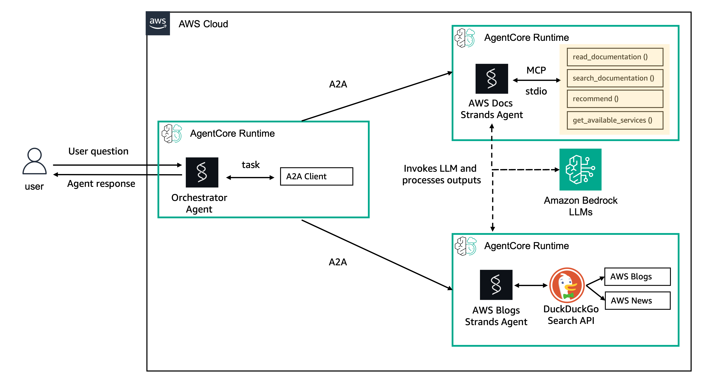

## Getting Started with A2A on AgentCore Runtime

### Overview

Amazon Bedrock AgentCore Runtime is a secure, serverless runtime designed for deploying and scaling AI agents and tools. 
It supports any frameworks, models, and protocols, enabling developers to transform local prototypes into production-ready solutions with minimal code changes.

[Strands Agents](https://strandsagents.com/latest/) is a simple-to-use, code-first framework for building agents.

Recently, AWS announced [A2A support](https://docs.aws.amazon.com/bedrock-agentcore/latest/devguide/runtime-a2a.html) for AgentCore Runtime.

In this example, we'll build a multi-agent systems using Amazon Bedrock AgentCore and Strands Agents.

This tutorial will navigate through the creation of 3 agents. The first one an AWS Documentation expert, that will consume AWS Docs using MCP. The second one will search on web latest blogs and AWS News and the third one will be an orchestrator, that will invoke the previous ones using MCP.

### Tutorials overview

In these tutorials we will cover the following functionality:

- [1 - Getting Started with A2A with Strands and Bedrock AgentCore](01-a2a-getting-started-agentcore-strands.ipynb)
- [2 - Create a orchestrator, that invoke sub-agents using A2A](02-a2a-deploy-orchestrator.ipynb)
- [3 - Clean Up](03-a2a-cleanup.ipynb)
