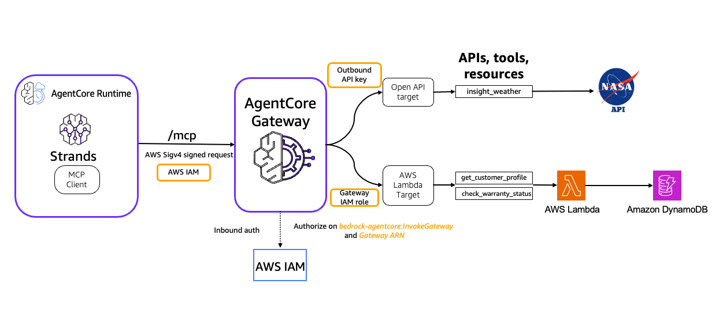

# Integrate Amazon Bedrock AgentCore Gateway with Amazon Bedrock AgentCore Runtime

[Amazon Bedrock AgentCore Gateway](https://docs.aws.amazon.com/bedrock-agentcore/latest/devguide/gateway.html) provides customers a way to turn their existing AWS Lambda functions & APIs (OpenAPI and Smithy) into fully-managed MCP servers without needing to manage infra or hosting. [Amazon Bedrock AgentCore Runtime](https://docs.aws.amazon.com/bedrock-agentcore/latest/devguide/agents-tools-runtime.html) provides a secure, serverless and purpose-built hosting environment for deploying and running AI agents or tools. In this tutorial we will integrate Amazon Bedrock AgentCore Gateway with AgentCore runtime and [Strands agents](https://strandsagents.com/latest/).

## Tutorial Details

| Information          | Details                                                   |
|:---------------------|:----------------------------------------------------------|
| Tutorial type        | Interactive                                               |
| AgentCore components | AgentCore Gateway, AgentCore Identity, AgentCore Runtime  |
| Agentic Framework    | Strands Agents                                            |
| Gateway Target type  | AWS Lambda, OpenAPI target                                |
| Inbound Auth IdP     | AWS IAM                                                   |
| Outbound Auth        | AWS IAM (AWS Lambda), API Key (OpenAPI target)            |
| LLM model            | Anthropic Claude Sonnet 3.7, Amazon Nova Pro              |
| Tutorial components  | Creating AgentCore Gateway and Invoking AgentCore Gateway |
| Tutorial vertical    | Cross-vertical                                            |
| Example complexity   | Medium                                                    |
| SDK used             | boto3                                                     |

## Tutorial Architecture

In this tutorial we will transform operations defined in AWS lambda function & Restful API into MCP tools and host it in Bedrock AgentCore Gateway. We will demonstrate the ingress auth using AWS IAM credentials in AWS Sigv4 format. We will deploy a Strands Agent utilizing AgentCore Gateway tools on AgentCore runtime.

For demonstration purposes, we will use a Strands Agent using [Amazon Bedrock](https://aws.amazon.com/bedrock/) models.

