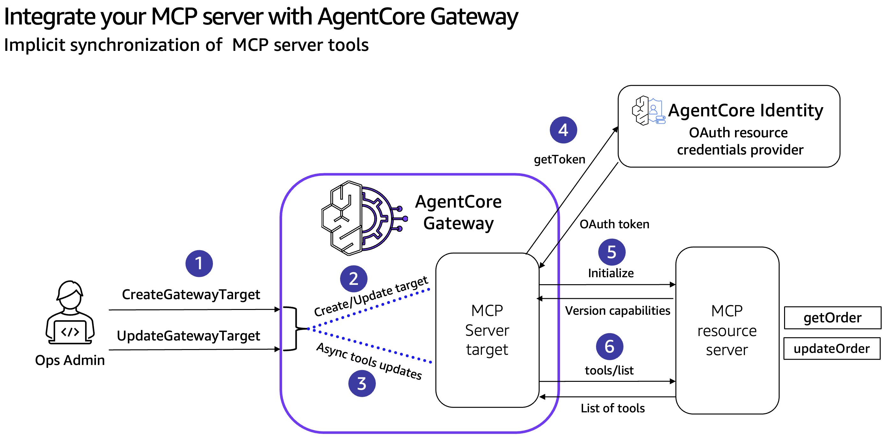

# Integrate your MCP Server with AgentCore Gateway

## Overview
Amazon Bedrock AgentCore Gateway now supports MCP servers as native targets alongside existing REST APIs and AWS Lambda functions. This enhancement allows organizations to integrate their MCP server implementations through a unified interface, eliminating the need for writing custom client code per MCP Server. The Gateway addresses key enterprise challenges in scaling AI agent deployments across multiple teams and servers by centralizing tool management, authentication, and routing.

The Gateway employs a centralized management framework that simplifies tool discovery, standardizes security protocols, and reduces operational complexity when scaling from dozens to hundreds of MCP servers. This unified approach allows enterprises to maintain consistent security and operational standards while efficiently managing their AI agent infrastructure through a single interface, eliminating the need for multiple separate gateways and reducing the overall maintenance burden.

### Refreshing tool definitions of your MCP servers in AgentCore Gateway
The SynchronizeGateway API enables on-demand synchronization of tools from MCP server targets through a sequence of carefully orchestrated steps. An Ops Admin initiates the process by making a SynchronizeGateway API call to the AgentCore Gateway, launching an asynchronous operation to update tool definitions. This control is particularly valuable after modifying MCP server configurations.

For OAuth-authenticated targets, the AgentCore Gateway first communicates with the AgentCore Identity service to obtain and validate credentials. The Identity service acts as an OAuth resource credentials provider, returning the necessary tokens. If credential validation fails at this stage, the synchronization process immediately terminates, and the target transitions to a FAILED state.

Upon successful authentication (or immediately for targets configured without authentication), the Gateway initializes a session with the MCP server, establishing a secure connection. The Gateway then makes paginated calls using the tools/list capability, processing tools in efficient batches of 100 to optimize performance and resource utilization. 

As tools are retrieved, the Gateway normalizes their definitions by adding target-specific prefixes to prevent naming conflicts with other targets. This normalization process maintains consistency while preserving essential metadata from the original MCP server definitions. Throughout the process, the Gateway enforces a strict limit of 10,000 tools per target to ensure system stability. The API implements optimistic locking during synchronization to prevent concurrent modifications that could lead to inconsistent states. The cached tool definitions ensure consistent high performance for ListTools operations between synchronizations.

### Implicit synchronization of tools schema
During CreateGatewayTarget and UpdateGatewayTarget operations, AgentCore Gateway automatically syncs tool schemas that differs from the explicit SynchronizeGateway API. This built-in sync ensures new or updated MCP targets are ready for immediate use and maintains data consistency. While this makes create/update operations slower compared to other target types, it guarantees that targets marked as READY have valid tool definitions and prevents issues from targets with unvalidated tool definitions.

### Tutorial Details

| Information          | Details                                                                |
|:---------------------|:-----------------------------------------------------------------------|
| Tutorial type        | Interactive                                                            |
| AgentCore components | AgentCore Gateway, AgentCore Identity, AgentCore Runtime               |
| Agentic Framework    | Strands Agents                                                         |
| Gateway Target Type  | MCP Server                                                             |
| Inbound Auth IdP     | Amazon Cognito, but can use others                                     |
| Outbound Auth        | Amazon Cognito, but can use others                                     |
| LLM model            | Anthropic Claude Sonnet 4                                              |
| Tutorial components  | Creating AgentCore Gateway with MCP Target and synchronize the tools   |
| Tutorial vertical    | Cross-vertical                                                         |
| Example complexity   | Easy                                                                   |
| SDK used             | boto3                                                                  |

## Tutorial Architecture

### Tutorial Key Features

* Integrate the MCP Server with AgentCore Gateway
* Perform explicit and implicit synchronization to refresh tool definitions

## Tutorials Overview

In these tutorials we will cover the following functionality:

- [Integrate the MCP Server with AgentCore Gateway](01-mcp-server-target.ipynb)
- [Perform explicit and implicit synchronization to refresh tool definitions](02-mcp-target-synchronization.ipynb)

