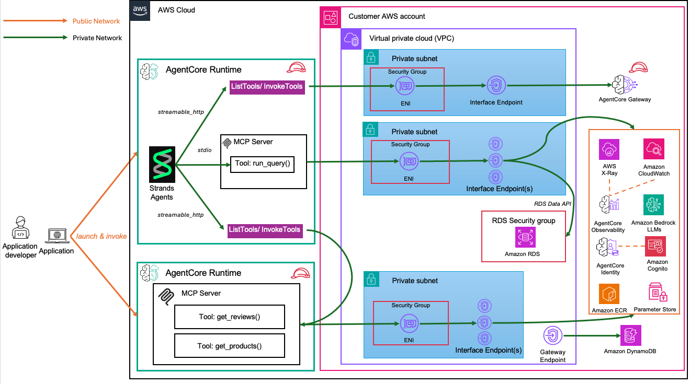
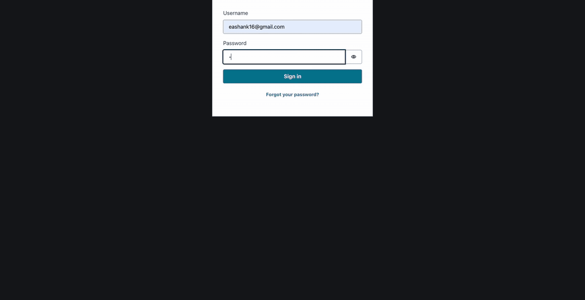
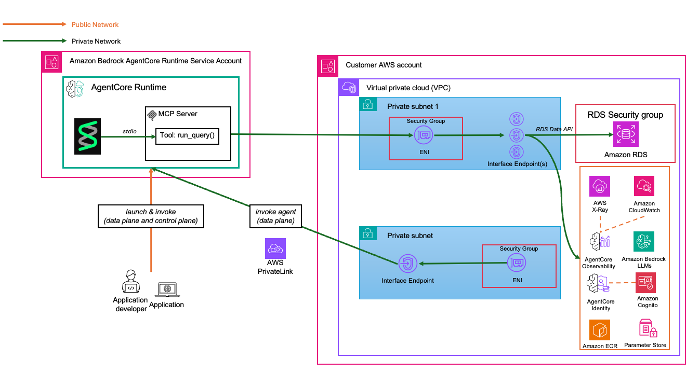
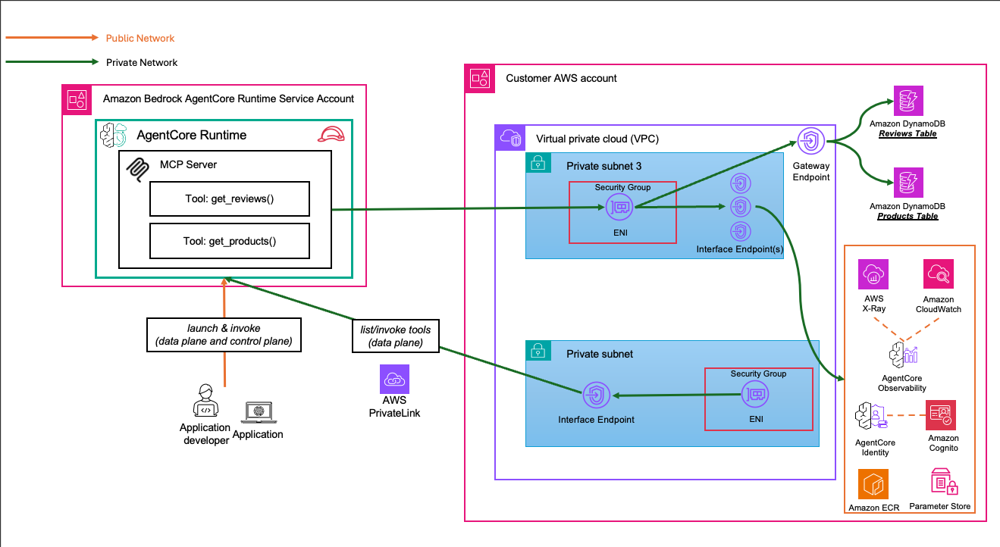

# Customer Support Assistant - Private VPC

> [!IMPORTANT]
> The examples provided in this repository are for experimental and educational purposes only. They demonstrate concepts and techniques but are not intended for direct use in production environments.

This is a customer support agent implementation using Amazon Bedrock AgentCore deployed in a fully private VPC environment. The system provides an AI-powered customer support interface with capabilities for warranty checking, customer profile management, and cross-system data access across multiple data sources including Aurora PostgreSQL, DynamoDB tables, and Lambda-based APIs. The architecture demonstrates secure, isolated deployment using VPC endpoints for AWS service access without internet connectivity.

## Architecture Overview



## Demo



## Prerequisites

1. **AWS Account**: You need an active AWS account with appropriate permissions
   - [Create AWS Account](https://aws.amazon.com/account/)
   - [AWS Console Access](https://aws.amazon.com/console/)

2. **AWS CLI**: Install and configure AWS CLI with your credentials
   - [Install AWS CLI](https://docs.aws.amazon.com/cli/latest/userguide/getting-started-install.html)
   - [Configure AWS CLI](https://docs.aws.amazon.com/cli/latest/userguide/cli-configure-quickstart.html)

   ```bash
   aws configure
   ```

3. **Bedrock Model Access**: Enable access to Amazon Bedrock Anthropic Claude 4.0 models in your AWS region
   - Navigate to [Amazon Bedrock Console](https://console.aws.amazon.com/bedrock/)
   - Go to "Model access" and request access to:
     - Anthropic Claude 4.0 Sonnet model
     - Anthropic Claude 3.5 Haiku model
   - [Amazon Bedrock Model Access Guide](https://docs.aws.amazon.com/bedrock/latest/userguide/model-access.html)

4. Install uv using [guide](https://docs.astral.sh/uv/getting-started/installation/).

5. **Supported Regions**: This solution is currently tested and supported in the following AWS regions:

   | Region Code   | Region Name          | Status      |
   |---------------|----------------------|-------------|
   | `us-west-2`   | US West (Oregon)     | ✅ Supported |

   > **Note**: To deploy in other regions, you'll need to update the DynamoDB prefix list mappings in `cloudformation/vpc-stack.yaml`. See the [VPC Stack documentation](cloudformation/vpc-stack.yaml) for details.

## Deployment Steps

> [!NOTE]
> This script automates deployment of resources in your AWS Account, please refer [deployed resources](#deployed-resources) to understand the resources that will be created.

```bash
# Make it executable
chmod +x deploy.sh

./deploy.sh --help
# Or customize the model
./deploy.sh --model global.anthropic.claude-sonnet-4-20250514-v1:0 --region us-west-2 --env dev --email <EmailAddress> --password <Password>


```

### Deployed Resources

The deployment creates the following CloudFormation stacks and AWS resources:

<details>
<summary><b>0. S3 Bucket</b> (Created by <code>deploy.sh</code>)</summary>

- **1 S3 Bucket** with auto-generated name (`customersupportvpc-*` prefix)
- **Versioning Enabled** for CloudFormation template version control
- **Purpose**: Hosts all CloudFormation nested stack templates
- **Lifecycle**: Can be deleted after successful deployment if templates won't be updated

</details>

<details>
<summary><b>1. VPC Stack</b> (<code>vpc-stack.yaml</code>)</summary>

- **1 VPC** with DNS support enabled
- **4 Private Subnets** across 3 availability zones
- **1 Route Table** for private subnets
- **13 VPC Endpoints** (Interface & Gateway):
  - Bedrock Runtime & AgentCore
  - ECR (API & Docker)
  - CloudWatch Logs & Monitoring
  - DynamoDB Gateway Endpoint
  - S3 Gateway Endpoint
  - Secrets Manager
  - RDS Data API
  - KMS
  - SSM Parameter Store
  - X-Ray
- **3 Security Groups** (VPC Endpoints, Agent Runtime, MCP Runtime)
- **1 KMS Key** for VPC Flow Logs encryption
- **1 CloudWatch Log Group** for VPC Flow Logs

</details>

<details>
<summary><b>2. Cognito Stack</b> (<code>cognito-m2m-stack.yaml</code>)</summary>

- **1 Cognito User Pool** for M2M authentication
- **1 User Pool Domain** for OAuth endpoints
- **1 Resource Server** with custom scopes (read, write, gateway, agent)
- **3 App Clients** (Gateway, Agent, MCP) with client credentials flow
- **3 Secrets Manager Secrets** for client configurations
- **1 KMS Key** for Secrets Manager encryption
- **1 Lambda Function** to retrieve and store client secrets
- **3 Custom Resources** to update client secrets

</details>

<details>
<summary><b>3. Aurora PostgreSQL Stack</b> (<code>aurora-postgres-stack.yaml</code>)</summary>

- **1 Aurora PostgreSQL Cluster** with RDS Data API enabled
- **1 Aurora Instance** (db.r5.large)
- **1 DB Subnet Group** across 2 subnets
- **1 KMS Key** for database encryption
- **2 Security Groups** (Aurora, Lambda)
- **1 S3 Bucket** for Lambda layer artifacts
- **1 CodeBuild Project** for psycopg2 layer build
- **1 Lambda Layer** (psycopg2)
- **2 Lambda Functions** (layer builder, mock data loader)
- **Sample Data**: Users, Products, Orders tables with mock records

</details>

<details>
<summary><b>4. DynamoDB Stack</b> (<code>dynamodb-stack.yaml</code>)</summary>

- **2 DynamoDB Tables**:
  - Reviews table (with 3 GSIs: product, customer, rating)
  - Products table (with 4 GSIs: category, name, price, stock)
- **1 KMS Key** for DynamoDB encryption
- **1 Lambda Function** for data population
- **2 SSM Parameters** for table names
- **Sample Data**: 5 reviews and 5 products

</details>

<details>
<summary><b>5. MCP Server Stack</b> (<code>mcp-server-stack.yaml</code>)</summary>

- **1 ECR Repository** for MCP Docker images
- **1 Bedrock AgentCore MCP Runtime**
- **1 CodeBuild Project** for Docker image builds
- **1 Lambda Function** for build orchestration
- **1 Lambda Function** for ECR image notifications
- **1 EventBridge Rule** for automated updates
- **1 OAuth2 Credential Provider** for MCP authentication
- **3 IAM Roles** (Runtime Execution, CodeBuild, Lambda)

</details>

<details>
<summary><b>6. Gateway Stack</b> (<code>gateway-stack.yaml</code>)</summary>

- **1 Bedrock AgentCore Gateway** with MCP protocol
- **1 Gateway Target** (Lambda integration)
- **1 Lambda Function** for customer support tools (warranty check, profile lookup)
- **1 Lambda Function** for gateway management
- **1 Lambda Function** for data population
- **2 DynamoDB Tables**:
  - Warranty table (encrypted with KMS)
  - Customer Profile table (with 2 GSIs: email, phone)
- **1 KMS Key** for DynamoDB encryption
- **1 OAuth2 Credential Provider** for Gateway authentication
- **3 SSM Parameters** (gateway ID, ARN, URL)
- **3 IAM Roles** (Gateway, Lambda, Management)
- **Sample Data**: 5 warranties and 5 customer profiles

</details>

<details>
<summary><b>7. Agent Server Stack</b> (<code>agent-server-stack.yaml</code>)</summary>

- **1 ECR Repository** for Agent Docker images
- **1 Bedrock AgentCore Agent Runtime** with HTTP protocol
- **1 CodeBuild Project** for Agent Docker builds
- **2 Lambda Functions** (build orchestration, ECR notifications)
- **1 EventBridge Rule** for automated updates
- **1 OAuth2 Credential Provider** for Agent authentication
- **4 IAM Roles** (Runtime Execution, CodeBuild, Lambda)
- **Environment Variables**: Model ID, MCP ARN, Gateway Provider, Aurora credentials

</details>

## Testing

After deployment, you can test the system using the provided test scripts:

### Test Agent Runtime

Start an interactive chat session with the Agent Runtime:



```bash
# Install dependencies
uv sync

# Start interactive session
uv run python test/connect_agent.py
```

This will launch an interactive chat interface where you can have a conversation with the agent. Type your questions and press Enter to send them. Type `q` or `quit` to exit.

**Parameters:**

- `--verbose` / `-v` (optional): Enable verbose logging
- `--debug` (optional): Enable debug logging

### Test MCP Server

Test the MCP DynamoDB server and list available tools:



```bash
# Install dependencies
uv sync

uv run python test/connect_mcp.py
```

**Parameters:**

- `--verbose` / `-v` (optional): Enable verbose logging
- `--debug` (optional): Enable debug logging

This script will:

1. Connect to the MCP server
2. List all available tools (get_reviews, get_products, etc.)
3. Run test queries against the DynamoDB tables

### Test AgentCore Gayeway


```bash
  # Install dependencies
  uv sync

  # Test the gateway
  uv run python test/connect_gateway.py --prompt "Check warranty status for serial number LAPTOP001A1B2C" 

  # With verbose logging
  uv run python test/connect_gateway.py --prompt "Get customer profile for CUST001" 

  # With custom stack name
```

- `--verbose` / `-v` (optional): Enable verbose logging
- `--debug` (optional): Enable debug logging

## React Frontend

Run the [frontend](./frontend/README.md) using following commands.

```bash
cd frontend
npm install

chmod +x ./setup-env.sh
./setup-env.sh

npm run dev

```

## Sample Queries

1. Can you provide a complete profile for customer CUST001 including their purchase history and support details?
2. Tell me about the Laptop Pro product (serial number: LAPTOP001A1B2C, review ids 1 and 2) including customer reviews, inventory status, and warranty information.
3. What can you tell me about Bob Johnson's account (CUST003) and any issues he might have had with his recent purchases?
4. Which customers have purchased laptops and what do they think about them? Also check current inventory levels.
5. Show me all Electronics category products, their reviews, and which customers prefer this category based on their purchase patterns.
6. Trace the complete customer journey for Jane Smith from registration to her latest interaction.
7. Verify data consistency between systems for customer CUST004 and highlight any discrepancies.
8. Which customers are most valuable and what products do they prefer? Include their support engagement levels.

## Cleanup

To remove the deployed resources, use the provided cleanup script:

```bash
# Make it executable
chmod +x cleanup.sh

./cleanup.sh --help

# Delete all stacks except VPC
./cleanup.sh --delete-s3  --region us-west-2

```

> [!WARNING]
> Amazon Bedrock AgentCore Runtime creates [ENIs](https://docs.aws.amazon.com/AWSEC2/latest/UserGuide/using-eni.html) in the VPC. These ENIs take ~8 hours to be automatically removed by the service. Please manually delete the VPC stack after the ENIs are removed.

```bash
./cleanup.sh --delete-vpc  --region us-west-2
```
