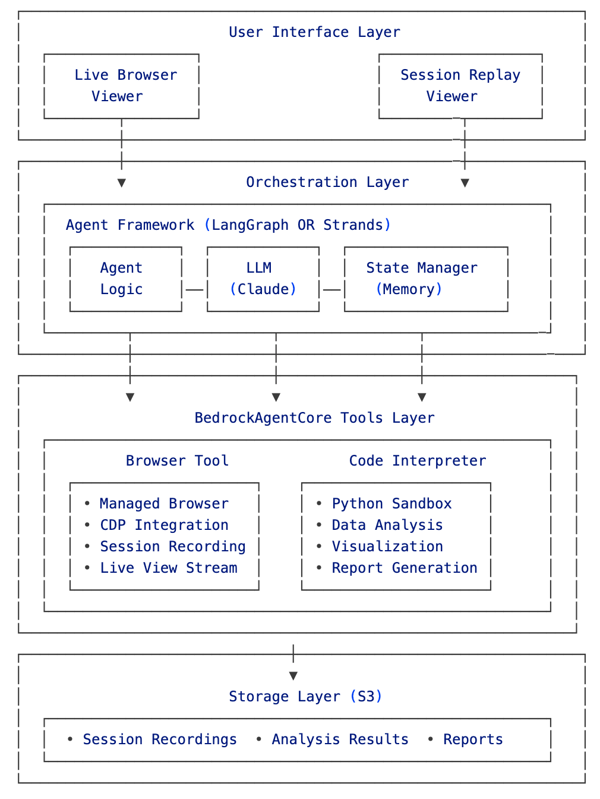

# Market Intelligence Platform

An enterprise-grade automated web intelligence gathering system powered by Amazon Bedrock AgentCore, demonstrating two different architectural approaches: LangGraph and Strands.

## ⚠️ Important Note on Code Structure

This repository contains **two independent implementations** that cannot share most code due to fundamental architectural differences:

- **LangGraph** (`/langgraph`) - Graph-based workflow with explicit state management
- **Strands** (`/strands`) - Agent-based tool orchestration with built-in AWS integration

Only configuration files and utilities are shared between implementations. Each has its own version of core components due to different async handling, LLM invocation patterns, and state management approaches.

## 🏗️ Architecture Overview



## 🏗️ Architecture Differences

### Why Separate Implementations?

The two frameworks have incompatible approaches to:

1. **Event Loop Management**
   - LangGraph: Standard async/await patterns
   - Strands: Requires nest_asyncio and thread-safe wrappers

2. **LLM Invocation**
   - LangGraph: Uses langchain methods (`await llm.ainvoke()`)
   - Strands: Direct boto3 calls to Bedrock

3. **State Management**
   - LangGraph: Custom TypedDict state with graph nodes
   - Strands: Built-in agent.state with safe accessors

4. **Tool Execution**
   - LangGraph: Tools called within graph nodes
   - Strands: Tools as decorated functions with special handling

## 📁 Project Structure

```
enterprise-web-intelligence-agent/
├── shared/                     # Minimal shared components
│   ├── config.py              # Configuration (shared)
│   ├── cleanup_resources.py   # AWS cleanup scripts (shared)
│   └── utils/
│       └── s3_datasource.py   # S3 replay utilities (shared)
│
├── langgraph/                  # Complete LangGraph implementation
│   ├── agent.py               # Graph-based orchestration
│   ├── browser_tools.py      # Original async version
│   ├── analysis_tools.py     # LangChain LLM calls
│   ├── run_agent.py          # Entry point
│   ├── requirements.txt      # LangGraph dependencies
│   └── utils/
│       └── imports.py        # Path setup for LangGraph
│
└── strands/                    # Complete Strands implementation
    ├── agent.py               # Agent-based orchestration
    ├── browser_tools.py      # Modified for event loops
    ├── analysis_tools.py     # Direct boto3 calls
    ├── run_agent.py          # Entry point
    ├── requirements.txt      # Strands dependencies
    └── utils/
        └── imports.py        # Path setup for Strands
```

## 🚀 Installation

### Prerequisites
- AWS Account with Bedrock access
- Claude 3.7 Sonnet Model access enables in Bedrock (us-west-2 region)
- IAM role with appropriate permissions
- S3 bucket for recordings (Optional - will be created automatically if not specified)

### Environment Setup

```bash
# Clone the repository
git clone https://github.com/awslabs/amazon-bedrock-agentcore-samples.git
cd amazon-bedrock-agentcore-samples/02-use-cases/enterprise-web-intelligence-agent
```

### LangGraph Version
```bash
cd langgraph
uv pip install -r requirements.txt
```

### Strands Version
```bash
cd strands
uv pip install -r requirements.txt
```

## 🔧 Configuration

Both implementations share the same configuration. The S3 bucket is optional - if not specified, the agent will create one automatically using your AWS account ID:

```bash
# Required
export AWS_REGION="us-west-2"
export AWS_ACCOUNT_ID="your-account-id"  # Required for automatic bucket creation

# Required - IAM role with BedrockAgentCore permissions
export RECORDING_ROLE_ARN="arn:aws:iam::your-account-id:role/BedrockAgentCoreRole"

# Optional - S3 bucket (will be created as bedrock-agentcore-recordings-{account-id} if not specified)
export S3_RECORDING_BUCKET="your-recordings-bucket"  

# Optional - Custom ports
export LIVE_VIEW_PORT=8000  # Default: 8000
export REPLAY_VIEWER_PORT=8001  # Default: 8001
```

### IAM Role Requirements

The IAM role must have the following permissions:

- BedrockAgentCore browser operations (create, delete, list)
- S3 read/write access to the recordings bucket
- Bedrock model invocation permissions

## 📊 Implementation Comparison

| Component | LangGraph | Strands |
|-----------|-----------|---------|
| **browser_tools.py** | Original async/await | Modified with nest_asyncio |
| **analysis_tools.py** | LangChain LLM calls | Direct boto3 calls |
| **Event loops** | Standard asyncio | Thread-safe wrappers |
| **LLM calls** | `await llm.ainvoke()` | `bedrock_client.invoke_model()` |
| **State access** | Direct dictionary | Safe getter with defaults |
| **Error handling** | Graph node boundaries | Tool-level try/catch |
| **Session persistence** | Custom implementation | Built-in S3SessionManager |
| **Code reuse** | ~20% shared | ~20% shared |

## ⚙️ Running Each Implementation

### LangGraph
```bash
cd langgraph
python run_agent.py
# Select competitors and analysis options
```

### Strands
```bash
cd strands  
python run_agent.py
# Select competitors and analysis options
```

## 🔍 Key Differences in Code

### Example: LLM Invocation

**LangGraph** (`langgraph/browser_tools.py`):
```python
response = await self.llm.ainvoke([HumanMessage(content=prompt)])
```

**Strands** (`strands/browser_tools.py`):
```python
response = bedrock_client.invoke_model(
    modelId=self.config.llm_model_id,
    body=json.dumps(native_request)
)
```

### Example: Event Loop Handling

**LangGraph**: Standard async
```python
async def analyze_competitor(self, state):
    result = await self.browser_tools.navigate_to_url(url)
```

**Strands**: Thread-safe execution
```python
future = asyncio.run_coroutine_threadsafe(
    self._analyze_website_async(name, url),
    self.browser_loop
)
return future.result(timeout=120)
```

### Example: State Management

**LangGraph**: Direct state dictionary
```python
state["competitor_data"][name] = extracted_data
current_index = state["current_competitor_index"]
```

**Strands**: Safe state accessors with defaults
```python
competitor_data = self._safe_state_get("competitor_data", {})
competitor_data[name] = extracted_data
self.agent.state.set("competitor_data", competitor_data)
```

## Clean Up

#### Automatic Cleanup
Both implementations automatically clean up resources when the program ends:

- BedrockAgentCore browsers are deleted
- Code Interpreter sessions are terminated
- Playwright connections are closed

#### Manual Cleanup
For orphaned resources or old recordings:

```bash
# Clean up stuck browsers (main cost driver at $0.10/hour)
python shared/cleanup_resources.py

# Also delete old S3 recordings
python shared/cleanup_resources.py --delete-old-recordings

# Schedule automatic cleanup via cron
crontab -e
# Add: 0 2 * * * cd /path/to/project && python shared/cleanup_resources.py
```

## 🚀 Features

Both implementations provide:

- **Live Browser Viewing:** Watch the agent navigate in real-time
- **Interactive Control:** Take/release control during automation
- **Session Recording:** Complete audit trail saved to S3
- **Session Replay:** Time-travel debugging of past analyses
- **Network Interception:** Discover hidden API endpoints
- **LLM Extraction:** Claude 3.7 Sonnet understands page context
- **Code Interpreter:** Secure Python sandbox for analysis
- **Parallel Processing:** Analyze multiple competitors simultaneously

## 🤝 Contributing

When contributing, please note:
- Changes to `browser_tools.py` or `analysis_tools.py` must be made separately for each implementation
- Test both implementations independently
- Only update shared files if the change works for both frameworks


## 🆘 Support

- LangGraph issues: Check the graph execution and state management
- Strands issues: Check event loop handling and tool registration
- Both: Verify AWS credentials and Bedrock access

---

**Note**: This is a demonstration project showing two architectural approaches. Choose the implementation that best fits your needs:
- **LangGraph**: Better for complex workflows with explicit control
- **Strands**: Better for rapid development with AWS integration