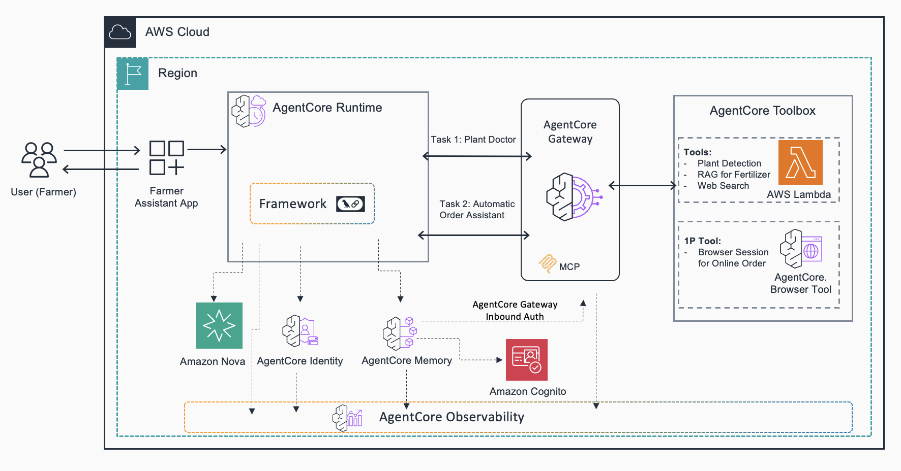
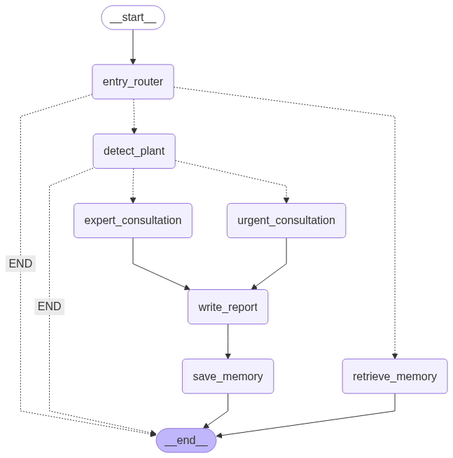

# Plant Health AI Assistant

A comprehensive plant health analysis system built with Amazon Bedrock AgentCore, featuring multi-agent orchestration, Agentcore Runtime, persistent memory, and MCP (Model Context Protocol) gateway integration.

## Overview

This project demonstrates how to build an intelligent plant health analysis system using AWS Bedrock AgentCore capabilities. The system combines plant detection, expert consultation, web search, and persistent memory to provide comprehensive plant care recommendations.

## Architecture


The system consists of two main components:

### Part 1: Gateway Setup (`01_plant_advisor_gateway.ipynb`)
- Creates 5 Lambda functions as MCP tools
- Sets up Bedrock AgentCore Gateway with Cognito authentication
- Configures plant detection, care advice, weather forecast, and web search tools

### Part 2: Runtime with Memory (`02_plant_advisor_runtime_mem.ipynb`)
- Implements LangGraph-based multi-agent workflow
- Integrates persistent memory for plant analysis history
- Deploys to AgentCore Runtime with Docker containerization

## Key Components

### 1. Multi-Agent LangGraph Workflow

- **Entry Router**: Determines if query is for analysis or history retrieval
- **Plant Detection Agent**: Identifies plant type and health issues from images
- **Care Agent**: Provides expert treatment advice
- **Web Search Agent**: Finds latest research and recommendations
- **Memory Agents**: Save and retrieve plant analysis history

### 2. Amazon Bedrock AgentCore Runtime
- **Serverless Execution**: Secure, serverless runtime for deploying and scaling AI agents
- **Auto-scaling**: Automatic scaling based on demand
- **Framework Agnostic**: Works with LangGraph and other agentic frameworks
- **Production Ready**: Enterprise-grade security and reliability

### 3. AWS Bedrock AgentCore Memory
- Persistent storage for plant analysis sessions
- Actor-based memory isolation (farmer-specific)
- 30-day retention for plant health tracking
- Conversation-style memory format

### 4. MCP Gateway Tools
- **Plant Detection**: Analyzes plant images for species and health issues
- **Plant Care**: Provides expert care recommendations
- **Plant Web Search**: Searches for specific plant care information
- **Weather Forecast**: Gets weather data for plant care planning
- **Web Search**: General web search capabilities

## Prerequisites

- Python 3.10 or higher
- AWS account with Bedrock AgentCore access
- Docker or Finch installed and running
- Jupyter Notebook environment
- Tavily API key for web search functionality

## Setup Instructions

### 1. Environment Setup

```bash
# Install uv for package management
pip install uv

# Create virtual environment
uv python install 3.10
uv venv --python 3.10
source .venv/bin/activate

# Install dependencies
uv add -r requirements.txt --active
```
### 2. Gateway Configuration (Notebook 01)

1. Update the `TAVILY_API_KEY` in the notebook
2. Run all cells to:
   - Create Lambda functions for plant analysis tools
   - Set up Cognito authentication
   - Create MCP Gateway
   - Register Lambda functions as MCP tools
   - Test the gateway functionality

### 3. Runtime Deployment (Notebook 02)

Run all cells to:
- Load configuration from notebook 1
- Create AgentCore Memory store
- Deploy LangGraph workflow to AgentCore Runtime
- Test with plant images and memory queries

## Features

- **Image-based Plant Detection**: Upload plant photos for automated species identification
- **Health Assessment**: Detailed analysis of plant health issues and symptoms
- **Expert Recommendations**: Comprehensive care advice based on plant type and condition
- **Memory Integration**: Persistent storage of analysis history for tracking plant health over time
- **Multi-modal Search**: Web search integration for latest plant care research
- **Weather Integration**: Weather-aware plant care recommendations
- **Scalable Architecture**: Serverless deployment with automatic scaling

## File Structure

```
├── 01_plant_advisor_gateway.ipynb     # Gateway setup and MCP tools
├── 02_plant_advisor_runtime_mem.ipynb # Runtime deployment with memory
├── requirements.txt                    # Python dependencies
├── Lambda/                             # Lambda function code
│   ├── plant_care.py
│   ├── plant_detection.py
│   ├── plant_websearch.py
│   ├── weather_forecast.py
│   └── websearch.py
├── utils/
│   └── utils.py                        # Utility functions
├── Image/                              # Architecture diagrams and sample images
│   ├── solution_architecture_diagram.png
│   ├── enhanced_plant_workflow.png
│   └── sweet_potato_leaf.png
└── README.md
```


## Troubleshooting

### Common Issues

- **Runtime Deployment**: Ensure proper IAM roles and ARM64 platform compatibility
- **Memory Creation Errors**: Ensure IAM roles have proper permissions for AgentCore Memory
- **Gateway Authentication**: Verify Cognito configuration and token generation
- **Lambda Timeouts**: Increase timeout settings for image processing functions
- **Image Size Limits**: Resize images to stay within payload limits (recommended < 1MB)

### Debug Information

The system includes comprehensive debug information:
- AgentCore Runtime execution logs
- Memory operation status
- Gateway tool availability
- Lambda function execution logs

## Clean Up

To remove all resources created by this example:

### 1. Delete AgentCore Resources
```python
# Delete the deployed agent
runtime.delete_agent()

# Delete memory store
memory_client.delete_memory(memory_id=MEMORY_ID)
```
### 2. Delete Gateway Resources
#### Delete Lambda functions
```python
aws lambda delete-function --function-name plant-detection-target
aws lambda delete-function --function-name plant-care-target
aws lambda delete-function --function-name plant-web-search-target
aws lambda delete-function --function-name weather-forecast-target
aws lambda delete-function --function-name websearch-target

### Delete Gateway
aws bedrock-agentcore delete-gateway --gateway-id YOUR_GATEWAY_ID
```
### 3. Delete IAM Roles
```python
aws iam delete-role --role-name agentcore-plant-advisor-agent-langgraph-role
aws iam delete-role --role-name agentcore-mem-plant-advisor-mem-langgraph-role
```
### 4. Delete ECR Repository
```python
aws ecr delete-repository --repository-name bedrock-agentcore-plant_advisor_agent --force
```
## Contributing

This project demonstrates experimental capabilities of Amazon Bedrock AgentCore. For production use:

- Implement proper error handling and retry logic
- Add input validation and sanitization
- Configure appropriate IAM permissions
- Set up monitoring and alerting
- Implement user authentication and authorization

## License

This project is provided for educational and experimental purposes. See the main repository license for details.
