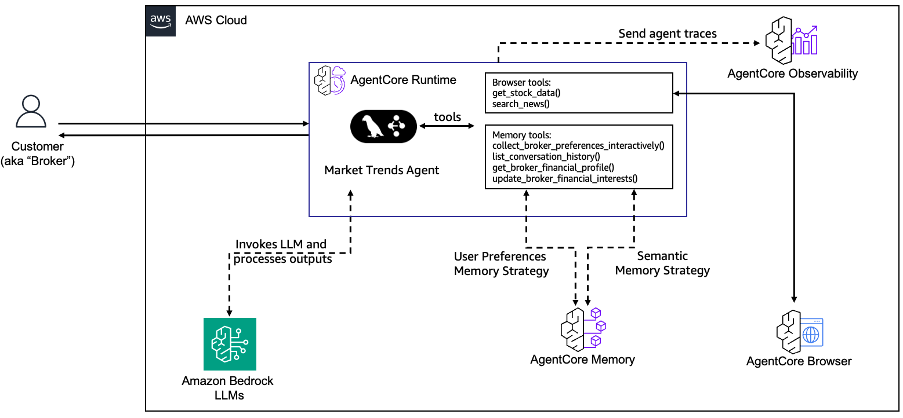

# Market Trends Agent

## Overview

This use case implements an intelligent financial analysis agent using Amazon Bedrock AgentCore that provides real-time market intelligence, stock analysis, and personalized investment recommendations. The agent combines LLM-powered analysis with live market data and maintains persistent memory of broker preferences across sessions.

## Use Case Architecture



| Information | Details |
|-------------|---------|
| Use case type | Conversational |
| Agent type | Graph |
| Use case components | Memory, Tools, Browser Automation |
| Use case vertical | Financial Services |
| Example complexity | Advanced |
| SDK used | Amazon Bedrock AgentCore SDK, LangGraph, Playwright |

## Features

### 🧠 Advanced Memory Management
- **Multi-Strategy Memory**: Uses both USER_PREFERENCE and SEMANTIC memory strategies
- **Broker Profiles**: Maintains persistent financial profiles for each broker/client
- **LLM-Based Identity**: Intelligently extracts and matches broker identities across sessions
- **Investment Preferences**: Stores risk tolerance, investment styles, and sector preferences

### 📊 Real-Time Market Intelligence
- **Conversational Broker Profiles**: Users provide structured broker information through chat ✅ **TESTED & READY**
- **Automatic Profile Parsing**: Intelligently extracts and stores broker preferences from structured input
- **Personalized Market Briefings**: Tailored analysis based on stored broker profiles
- **Multi-Source News**: Bloomberg, Reuters, WSJ, Financial Times, CNBC support
- **Live Stock Data**: Current prices, changes, and market performance metrics
- **Professional Standards**: Delivers institutional-quality analysis aligned with broker's risk tolerance and investment style

### 🌐 Browser Automation
- **Web Scraping**: Automated data collection from financial websites
- **Dynamic Content**: Handles JavaScript-rendered pages and interactive elements
- **Rate Limiting**: Built-in delays and retry logic for reliable data collection


The Market Trends Agent leverages Amazon Bedrock AgentCore's comprehensive capabilities to deliver personalized financial intelligence:

- **AgentCore Runtime**: Serverless execution environment for the LangGraph-based agent
- **AgentCore Memory**: Multi-strategy memory system storing broker preferences and financial insights
- **AgentCore Browser Tool**: Secure web scraping for real-time market data from financial websites
- **Claude Sonnet 4**: Advanced LLM for financial analysis and broker interaction
- **Multi-Source Integration**: Real-time data from Bloomberg, Reuters, WSJ, and other financial sources

## Quick Start

### Prerequisites
- Python 3.10+
- AWS CLI configured with appropriate credentials
- Docker or Podman installed and running
- Access to Amazon Bedrock AgentCore

### Installation & Deployment

1. **Install uv** (if not already installed)
```bash
# macOS/Linux
curl -LsSf https://astral.sh/uv/install.sh | sh

# Windows
powershell -c "irm https://astral.sh/uv/install.ps1 | iex"

# Or via pip
pip install uv
```

2. **Install Dependencies**
```bash
uv sync
```

3. **Deploy the Agent** (One Command!)
```bash
# Simple deployment
uv run python deploy.py

# Custom configuration (optional)
uv run python deploy.py \
  --agent-name "my-market-agent" \
  --region "us-west-2" \
  --role-name "MyCustomRole"
```

**Available Options:**
- `--agent-name`: Name for the agent (default: market_trends_agent)
- `--role-name`: IAM role name (default: MarketTrendsAgentRole)
- `--region`: AWS region (default: us-east-1)
- `--skip-checks`: Skip prerequisite validation

4. **Test the Agent**
```bash
uv run python test_agent.py
```

## Usage Examples

### 📋 Broker Profile Setup (First Interaction)
Send your broker information in this structured format:

```
Name: Yuval Bing
Company: HSBC
Role: Investment Advisor
Preferred News Feed: BBC
Industry Interests: oil, emerging markets
Investment Strategy: dividend
Risk Tolerance: low
Client Demographics: younger professionals, tech workers
Geographic Focus: North America, Asia-Pacific
Recent Interests: middle east geopolitics
```

The agent will automatically:
- Parse and store your profile in memory
- Provide personalized acknowledgment
- Tailor all future responses to your specific preferences

### 📊 Personalized Market Analysis
After setting up your profile, ask for market insights:

```
"What's happening with biotech stocks today?"
"Give me an analysis of the AI sector for my tech-focused clients"
"What are the latest ESG investing trends in Europe?"
```

The agent will provide analysis specifically tailored to:
- Your industry interests
- Your risk tolerance
- Your client demographics
- Your preferred news sources

### 🧪 Test the Broker Card Functionality
```bash
uv run python test_broker_card.py
```

This demonstrates the complete workflow:
1. Sending structured broker profile
2. Agent parsing and storing preferences
3. Receiving personalized market analysis

### 💬 Continue Interactive Conversations
After testing, continue chatting with your agent:

**Quick one-liner for immediate chat:**
```bash
uv run python -c "
import boto3, json
client = boto3.client('bedrock-agentcore', region_name='us-east-1')
with open('.agent_arn', 'r') as f: arn = f.read().strip()
print('💬 Market Trends Agent Chat (type \"quit\" to exit)')
while True:
    try:
        msg = input('\n🤖 You: ')
        if msg.lower() in ['quit', 'exit']: break
        resp = client.invoke_agent_runtime(agentRuntimeArn=arn, payload=json.dumps({'prompt': msg}))
        print('📈 Agent:', resp['response'].read().decode('utf-8'))
    except KeyboardInterrupt: break
"
```

## Architecture

### Use case Architecture

```
┌─────────────────────────────────────────────────────────────────┐
│                    Market Trends Agent                          │
├─────────────────────────────────────────────────────────────────┤
│  LangGraph Agent Framework                                      │
│  ├── Claude Sonnet 4 (LLM)                                     │
│  ├── Browser Automation Tools                                   │
│  └── Memory Management Tools                                    │
├─────────────────────────────────────────────────────────────────┤
│  AgentCore Multi-Strategy Memory                                │
│  ├── USER_PREFERENCE: Broker profiles & preferences            │
│  └── SEMANTIC: Financial facts & market insights               │
├─────────────────────────────────────────────────────────────────┤
│  External Data Sources                                          │
│  ├── Real-time Stock Data (Google Finance, Yahoo Finance)      │
│  ├── Financial News (Bloomberg)                                 │
│  └── Market Analysis APIs                                       │
└─────────────────────────────────────────────────────────────────┘
```

### Memory Strategies
- **USER_PREFERENCE**: Captures broker preferences, risk tolerance, investment styles
- **SEMANTIC**: Stores financial facts, market analysis, investment insights

### Available Tools

**Market Data & News** (`tools/browser_tool.py`):
- `get_stock_data(symbol)`: Real-time stock prices and market data
- `search_news(query, news_source)`: Multi-source news search (Bloomberg, Reuters, CNBC, WSJ, Financial Times, Dow Jones)

**Broker Profile Management** (`tools/broker_card_tools.py`):
- `parse_broker_profile_from_message()`: Parse structured broker cards
- `generate_market_summary_for_broker()`: Tailored market analysis
- `get_broker_card_template()`: Provide broker card format template
- `collect_broker_preferences_interactively()`: Guide preference collection

**Memory & Identity Management** (`tools/memory_tools.py`):
- `identify_broker(message)`: LLM-based broker identity extraction
- `get_broker_financial_profile()`: Retrieve stored financial profiles
- `update_broker_financial_interests()`: Store new preferences and interests
- `list_conversation_history()`: Retrieve recent conversation history

## Monitoring

### CloudWatch Logs
After deployment, monitor your agent:
```bash
# View logs (replace with your agent ID)
aws logs tail /aws/bedrock-agentcore/runtimes/{agent-id}-DEFAULT --follow
```

### Health Checks
- Built-in health check endpoints
- Monitor agent availability and response times

## Cleanup

### Complete Resource Cleanup
When you're done with the agent, use the cleanup script to remove all AWS resources:

```bash
# Complete cleanup (removes everything)
uv run python cleanup.py

# Preview what would be deleted (dry run)
uv run python cleanup.py --dry-run

# Keep IAM roles (useful if shared with other projects)
uv run python cleanup.py --skip-iam

# Cleanup in different region
uv run python cleanup.py --region us-west-2
```

**What gets cleaned up:**
- ✅ AgentCore Runtime instances
- ✅ AgentCore Memory instances  
- ✅ ECR repositories and container images
- ✅ CodeBuild projects
- ✅ S3 build artifacts
- ✅ SSM parameters
- ✅ IAM roles and policies (unless `--skip-iam`)
- ✅ Local deployment files

### Manual Cleanup (if needed)
If the automated cleanup fails, you can manually remove resources:

1. **AgentCore Runtime**: AWS Console → Bedrock → AgentCore → Runtimes
2. **AgentCore Memory**: AWS Console → Bedrock → AgentCore → Memory
3. **ECR Repository**: AWS Console → ECR → Repositories
4. **IAM Roles**: AWS Console → IAM → Roles (search for "MarketTrendsAgent")
5. **CodeBuild**: AWS Console → CodeBuild → Build projects

## Troubleshooting

### Common Issues

1. **Throttling Errors**
   - Wait a few minutes between requests
   - Your account may have lower rate limits
   - Check CloudWatch logs for details

2. **Container Build Fails**
   - Ensure Docker/Podman is running
   - Check network connectivity
   - Verify all required files are present

3. **Permission Errors**
   - The deployment script creates all required IAM permissions
   - Check AWS credentials are configured correctly

4. **Memory Instance Duplicates**
   - The agent uses SSM Parameter Store to prevent race conditions
   - If you see multiple memory instances, run: `uv run python cleanup.py`
   - Then redeploy with: `uv run python deploy.py`

### Debug Information
The deployment script includes comprehensive error reporting and will guide you through any issues.

## Security

### IAM Permissions
The deployment script automatically creates a role with:
- `bedrock:InvokeModel` (for Claude Sonnet)
- `bedrock-agentcore:*` (for memory and runtime operations)
- `ecr:*` (for container registry access)
- `xray:*` (for tracing)
- `logs:*` (for CloudWatch logging)

### Data Privacy
- Financial profiles are stored securely in Bedrock AgentCore Memory
- No sensitive data is logged or exposed
- All communications are encrypted in transit

## Contributing

1. Fork the repository
2. Create a feature branch
3. Make your changes
4. Add tests for new functionality
5. Submit a pull request

## License

This project is licensed under the MIT License - see the LICENSE file for details.