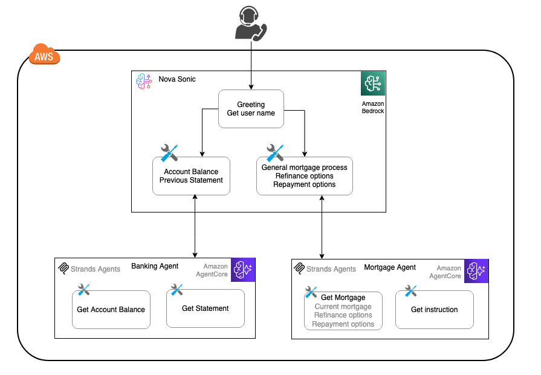

# Nova Sonic integration with AgentCore 

The [Amazon Nova Sonic model](https://aws.amazon.com/ai/generative-ai/nova/speech/) provides real-time, conversational interactions through bidirectional audio streaming, enabling natural, human-like conversational experiences. Agentic workflow integration extends Nova Sonic's capabilities by incorporating external context. 

## Nova Sonic Multi-Agent Architecture with AgentCore and Strands

Multi-agent architecture is a widely used pattern for designing AI assistants. In a voice assistant like Nova Sonic, this architecture coordinates multiple specialized agents to handle complex tasks. Each agent can operate independently, enabling parallel processing, modular design, and scalable solutions.

In this integration, we will use a banking voice assistant as a sample to demonstrate how to deploy specialized agents on [Amazon Bedrock AgentCore](https://aws.amazon.com/bedrock/agentcore/). We will use Nova Sonic as an orchestrator to delegate detailed inquiries to sub-agents written in [Strands Agents](https://strandsagents.com/latest/documentation/docs/) hosted on [AgentCore Runtime](https://docs.aws.amazon.com/bedrock-agentcore/latest/devguide/agents-tools-runtime.html).



The conversation flow begins with a greeting and collecting the user’s name, and then it can handle inquiries related to banking or mortgages. We use two sub-agents hosted on AgentCore to handle specialized logic:
- Banking Sub-Agent: Handles account balance checks, statements, and other banking-related inquiries.
- Mortgage Sub-Agent: Handles mortgage-related inquiries, including refinancing, rates, and repayment options.

> The Mortgage Agent and Banking Agent deployed on AgentCore Runtime return static responses. This sample is intended to showcase the architecture pattern and deployment process. In a real-world application, these agents would retrieve data from sources such as APIs, databases, RAG, or other backend services.

## Integration Architecture
Amazon Nova Sonic relies on ToolUse to integrate with agentic workflows. During Nova Sonic's event lifecycle, you can provide ToolUse configurations through the [PromptStart](https://docs.aws.amazon.com/nova/latest/userguide/input-events.html) event, which is designed to trigger when Sonic receives specific types of input.

For example, in this AgentCore sample, we configured ToolUse to trigger events when the Sonic built-in reasoning model determines (similar to intent classification) that the inquiry should be routed to the Banking or Mortgage sub-agents.

```
[
    {
        "toolSpec": {
            "name": "ac_bank_agent",
            "description": `Use this tool whenever the customer asks about their **bank account balance** or **bank statement**.  
                    It should be triggered for queries such as:  
                    - "What’s my balance?"  
                    - "How much money do I have in my account?"  
                    - "Can I see my latest bank statement?"  
                    - "Show me my account summary."`,
            "inputSchema": {
                "json": JSON.stringify({
                "type": "object",
                "properties": {
                    "accountId": {
                        "type": "string",
                        "description": "This is a user input. It is the bank account Id which is a numeric number."
                    },
                    "query": {
                        "type": "string",
                        "description": "The inquiry to the bank agent such as check account balance, get statement etc."
                    }
                },
                "required": [
                    "accountId", "query"
                ]
                })
            }
        }
    },
    {
        "toolSpec": {
            "name": "ac_mortgage_agent",
            "description": `Use this tool whenever the customer has a **mortgage-related inquiry**.  
                            It should be triggered for queries such as:  
                            - "What are the current mortgage rates?"  
                            - "Can I refinance my mortgage?"  
                            - "How do I apply for a mortgage?"  
                            - "Tell me about mortgage repayment options.`,
            "inputSchema": {
                "json": JSON.stringify({
                "type": "object",
                    "properties": {
                        "accountId": {
                            "type": "string",
                            "description": "This is a user input. It is the bank account Id which is a numeric number."
                        },
                        "query": {
                            "type": "string",
                            "description": "The inquiry to the mortgage agent such as mortgage rates, refinance, bank reference letter, repayment etc."
                        }
                    },
                    "required": ["accountId", "query"]
                })
            }
        }
    }
]
```
The application listening to Nova Sonic events will invoke the AgentCore instance, receive the response, and then pass it back to Nova Sonic for voice generation.

## Deploy the Sample Code
For sample code and full deployment instructions, please refer to the [amazon-nova-sample](https://github.com/aws-samples/amazon-nova-samples/tree/main/speech-to-speech/workshops/agent-core) repository.