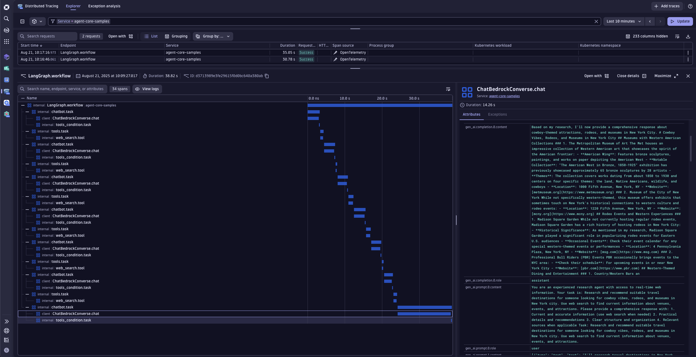

# Amazon Bedrock Agent Integration with Dynatrace

This example contains a demo of a Personal Assistant Agent built on top of [Bedrock AgentCore Agents](https://docs.aws.amazon.com/bedrock-agentcore/latest/devguide/what-is-bedrock-agentcore.html).


## Prerequisites

- Python 3.9 or higher
- Dynatrace Account
- AWS Account with appropriate permissions
- Access to the following AWS services:
   - Amazon Bedrock


## Dynatrace Instrumentation

> [!TIP]
> For detailed setup instructions, configuration options, and advanced use cases, please refer to the [Get Started Docs](https://docs.dynatrace.com/docs/shortlink/ai-ml-get-started).

Bedrock AgentCore comes with [Observability](https://docs.aws.amazon.com/bedrock-agentcore/latest/devguide/observability.html) support out-of-the-box.
Hence, we just need to register an [OpenTelemetry SDK](https://github.com/open-telemetry/opentelemetry-specification/blob/main/specification/overview.md#sdk) to send the data to Dynatrace AI Observability.

We simplified this process, hiding all the complexity inside [dynatrace.py](./dynatrace.py).
For sending data to your Dynatrace tenant, you can configure the `OTEL_ENDPOINT` env var with your Dynatrace URL for ingesting [OTLP](https://docs.dynatrace.com/docs/shortlink/otel-getstarted-otlpexport), for example: `https://wkf10640.live.dynatrace.com/api/v2/otlp`.

The API access token will be read from your filesystem under `/etc/secrets/dynatrace_otel` or from the environment variable `DT_TOKEN`. 


## How to use

### Setting your AWS keys

Follow the [Amazon Bedrock AgentCore documentation](https://docs.aws.amazon.com/bedrock-agentcore/latest/devguide/runtime-permissions.html) to configure your AWS Role with the correct policies.
Afterwards, you can set your AWS keys in your environment variables by running the following command in your terminal:


```bash
export AWS_ACCESS_KEY_ID==your_api_key
export AWS_SECRET_ACCESS_KEY==your_secret_key
export AWS_REGION=your_region
```

Ensure your account has access to the model `eu.anthropic.claude-3-7-sonnet-20250219-v1:0` used in this example. Please, refer to the
[Amazon Bedrock documentation](https://docs.aws.amazon.com/bedrock/latest/userguide/model-access-permissions.html) to see how to enable access to the model.
You can change the model used by configuring the environment variable `BEDROCK_MODEL_ID`.

### Setting your Dynatrace Token

Create a [Free Dynatrace Trial](https://www.dynatrace.com/signup/) for 15 days.
After a few minutes, you will get redirected to your tenant. The URL will look like `https://wkf10640.apps.dynatrace.com/`.
The value `wkf10640` is your environment id which will be needed later.

After that, you can create an Access Token:

1. In Dynatrace, go to **Access Tokens**. To find **Access Tokens**, press **Ctrl/Cmd+K** to search for and select **Access Tokens**.
2. In **Access Tokens**, select **Generate new token**.
3. Enter a **Token name** for your new token.
4. Give your new token the following permissions:
5. Search for and select all of the following scopes.
    * **Ingest OpenTelemetry traces** (`openTelemetryTrace.ingest`)
    * **Ingest logs** (`logs.ingest`)
    * **Read metrics** (`metrics.read`)
6. Select **Generate token**.
7. Copy the generated token to the clipboard. Store the token in a password manager for future use.


Afterwards, you can set your Dynatrace information in your environment variables by running the following command in your terminal:

```bash
export DT_TOKEN==your_access_token
export OTEL_ENDPOINT==https://{your-environment-id}.live.dynatrace.com/api/v2/otlp
```


### Run the app

You can start the example with the following command: `uv run main.py`
This will create an HTTP server that listens on the port `8080` that implements the required `/invocations` endpoint for processing the agent's requirements.

The Agent is now ready to be deployed. The best practice is to package code as container and push to ECR using CI/CD pipelines and IaC. 
You can follow the guide 
[here](https://github.com/awslabs/amazon-bedrock-agentcore-samples/blob/main/01-tutorials/01-AgentCore-runtime/01-hosting-agent/01-strands-with-bedrock-model/runtime_with_strands_and_bedrock_models.ipynb) 
to have a full step-by-step tutorial.

You can interact with your agent with the following command:

```bash
curl -X POST http://127.0.0.1:8080/invocations --data '{"prompt": "What is the weather now?"}'
```

Now you have full observability of your Bedrock AgentCore Agents in Dynatrace 🚀

