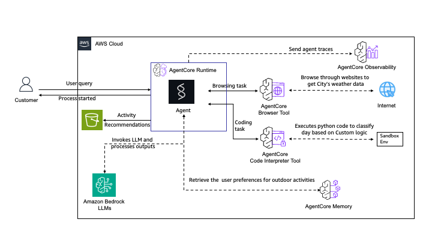

# End-to-End Weather Agent with Tools and Memory

This CloudFormation template deploys a complete Amazon Bedrock AgentCore Runtime with a sophisticated weather-based activity planning agent. This demonstrates the full power of AgentCore by integrating Browser tool, Code Interpreter, Memory, and S3 storage in a single deployment.

## Table of Contents

- [Overview](#overview)
- [Architecture](#architecture)
- [Prerequisites](#prerequisites)
- [Deployment](#deployment)
- [Testing](#testing)
- [Sample Queries](#sample-queries)
- [How It Works](#how-it-works)
- [Cleanup](#cleanup)
- [Cost Estimate](#cost-estimate)
- [Troubleshooting](#troubleshooting)
- [🤝 Contributing](#-contributing)
- [📄 License](#-license)

## Overview

This template creates a comprehensive AgentCore deployment that showcases:

### Core Components

- **AgentCore Runtime**: Hosts a Strands agent with multiple tools
- **Browser Tool**: Web automation for scraping weather data from weather.gov
- **Code Interpreter**: Python code execution for weather analysis
- **Memory**: Stores user activity preferences
- **S3 Bucket**: Stores generated activity recommendations
- **ECR Repository**: Container image storage
- **IAM Roles**: Comprehensive permissions for all components

### Agent Capabilities

The Weather Activity Planner agent can:

1. **Scrape Weather Data**: Uses browser automation to fetch 8-day forecasts from weather.gov
2. **Analyze Weather**: Generates and executes Python code to classify days as GOOD/OK/POOR
3. **Retrieve Preferences**: Accesses user activity preferences from memory
4. **Generate Recommendations**: Creates personalized activity suggestions based on weather and preferences
5. **Store Results**: Saves recommendations as Markdown files in S3

### Use Cases

- Weather-based activity planning
- Automated web scraping and data analysis
- Multi-tool agent orchestration
- Memory-driven personalization
- Asynchronous task processing

## Architecture



The architecture demonstrates a complete AgentCore deployment with multiple integrated tools:

**Core Components:**
- **User**: Sends weather-based activity planning queries
- **AWS CodeBuild**: Builds the ARM64 Docker container image with the agent code
- **Amazon ECR Repository**: Stores the container image
- **AgentCore Runtime**: Hosts the Weather Activity Planner Agent
  - **Weather Agent**: Strands agent that orchestrates multiple tools
  - Invokes Amazon Bedrock LLMs for reasoning and code generation
- **Browser Tool**: Web automation for scraping weather data from weather.gov
- **Code Interpreter Tool**: Executes Python code for weather analysis
- **Memory**: Stores user activity preferences (30-day retention)
- **S3 Bucket**: Stores generated activity recommendations
- **IAM Roles**: Comprehensive permissions for all components

**Workflow:**
1. User sends query: "What should I do this weekend in Richmond VA?"
2. Agent extracts city and uses Browser Tool to scrape 8-day forecast
3. Agent generates Python code and uses Code Interpreter to classify weather
4. Agent retrieves user preferences from Memory
5. Agent generates personalized recommendations
6. Agent stores results in S3 bucket using use_aws tool

## Prerequisites

### AWS Account Setup

1. **AWS Account**: You need an active AWS account with appropriate permissions
   - [Create AWS Account](https://aws.amazon.com/account/)
   - [AWS Console Access](https://aws.amazon.com/console/)

2. **AWS CLI**: Install and configure AWS CLI with your credentials
   - [Install AWS CLI](https://docs.aws.amazon.com/cli/latest/userguide/getting-started-install.html)
   - [Configure AWS CLI](https://docs.aws.amazon.com/cli/latest/userguide/cli-configure-quickstart.html)
   
   ```bash
   aws configure
   ```

3. **Bedrock Model Access**: Enable access to Amazon Bedrock models in your AWS region
   - Navigate to [Amazon Bedrock Console](https://console.aws.amazon.com/bedrock/)
   - [Bedrock Model Access Guide](https://docs.aws.amazon.com/bedrock/latest/userguide/model-access.html)

4. **Required Permissions**: Your AWS user/role needs permissions for:
   - CloudFormation stack operations
   - ECR repository management
   - IAM role creation
   - Lambda function creation
   - CodeBuild project creation
   - BedrockAgentCore resource creation (Runtime, Browser, CodeInterpreter, Memory)
   - S3 bucket creation

## Deployment

### Option 1: Using the Deploy Script (Recommended)

```bash
# Make the script executable
chmod +x deploy.sh

# Deploy the stack
./deploy.sh
```

The script will:
1. Deploy the CloudFormation stack
2. Wait for stack creation to complete
3. Display all resource IDs (Runtime, Browser, CodeInterpreter, Memory, S3 Bucket)

### Option 2: Using AWS CLI

```bash
# Deploy the stack
aws cloudformation create-stack \
  --stack-name weather-agent-demo \
  --template-body file://end-to-end-weather-agent.yaml \
  --capabilities CAPABILITY_NAMED_IAM \
  --region us-west-2

# Wait for stack creation
aws cloudformation wait stack-create-complete \
  --stack-name weather-agent-demo \
  --region us-west-2

# Get all outputs
aws cloudformation describe-stacks \
  --stack-name weather-agent-demo \
  --region us-west-2 \
  --query 'Stacks[0].Outputs'
```

### Option 3: Using AWS Console

1. Navigate to [CloudFormation Console](https://console.aws.amazon.com/cloudformation/)
2. Click "Create stack" → "With new resources"
3. Upload the `end-to-end-weather-agent.yaml` file
4. Enter stack name: `weather-agent-demo`
5. Review parameters (or use defaults)
6. Check "I acknowledge that AWS CloudFormation might create IAM resources"
7. Click "Create stack"

### Deployment Time

- **Expected Duration**: 15-20 minutes
- **Main Steps**:
  - Stack creation: ~2 minutes
  - Docker image build (CodeBuild): ~10-12 minutes
  - Runtime and tools provisioning: ~3-5 minutes
  - Memory initialization: ~1 minute

## Testing

### Using AWS CLI

```bash
# Get the Runtime ID from stack outputs
RUNTIME_ID=$(aws cloudformation describe-stacks \
  --stack-name weather-agent-demo \
  --region us-west-2 \
  --query 'Stacks[0].Outputs[?OutputKey==`AgentRuntimeId`].OutputValue' \
  --output text)

# Get the S3 bucket name
BUCKET_NAME=$(aws cloudformation describe-stacks \
  --stack-name weather-agent-demo \
  --region us-west-2 \
  --query 'Stacks[0].Outputs[?OutputKey==`ResultsBucket`].OutputValue' \
  --output text)

# Invoke the agent
aws bedrock-agentcore invoke-agent-runtime \
  --agent-runtime-id $RUNTIME_ID \
  --qualifier DEFAULT \
  --payload '{"prompt": "What should I do this weekend in Richmond VA?"}' \
  --region us-west-2 \
  response.json

# View the immediate response
cat response.json

# Wait a few minutes for processing, then check S3 for results
aws s3 ls s3://$BUCKET_NAME/

# Download the results
aws s3 cp s3://$BUCKET_NAME/results.md ./results.md
cat results.md
```

### Using AWS Console

1. Navigate to [Bedrock AgentCore Console](https://console.aws.amazon.com/bedrock-agentcore/)
2. Go to "Runtimes" in the left navigation
3. Find your runtime (name starts with `weather_agent_demo_`)
4. Click on the runtime name
5. Click "Test" button
6. Enter test payload:
   ```json
   {
     "prompt": "What should I do this weekend in Richmond VA?"
   }
   ```
7. Click "Invoke"
8. View the immediate response
9. Wait 2-3 minutes for background processing
10. Navigate to [S3 Console](https://console.aws.amazon.com/s3/) to download results.md from the results bucket

## Sample Queries

Try these queries to test the weather agent:

1. **Weekend Planning**:
   ```json
   {"prompt": "What should I do this weekend in Richmond VA?"}
   ```

2. **Specific City**:
   ```json
   {"prompt": "Plan activities for next week in San Francisco"}
   ```

3. **Different Location**:
   ```json
   {"prompt": "What outdoor activities can I do in Seattle this week?"}
   ```

4. **Vacation Planning**:
   ```json
   {"prompt": "I'm visiting Austin next week. What should I plan based on the weather?"}
   ```

## How It Works

### Step-by-Step Workflow

1. **User Query**: "What should I do this weekend in Richmond VA?"

2. **City Extraction**: Agent extracts "Richmond VA" from the query

3. **Weather Scraping** (Browser Tool):
   - Navigates to weather.gov
   - Searches for Richmond VA
   - Clicks "Printable Forecast"
   - Extracts 8-day forecast data (date, high, low, conditions, wind, precipitation)
   - Returns JSON array of weather data

4. **Code Generation** (LLM):
   - Agent generates Python code to classify weather days
   - Classification rules:
     - GOOD: 65-80°F, clear, no rain
     - OK: 55-85°F, partly cloudy, slight rain
     - POOR: <55°F or >85°F, cloudy/rainy

5. **Code Execution** (Code Interpreter):
   - Executes the generated Python code
   - Returns list of tuples: `[('2025-09-16', 'GOOD'), ('2025-09-17', 'OK'), ...]`

6. **Preference Retrieval** (Memory):
   - Fetches user activity preferences from memory
   - Preferences stored by weather type:
     ```json
     {
       "good_weather": ["hiking", "beach volleyball", "outdoor picnic"],
       "ok_weather": ["walking tours", "outdoor dining", "park visits"],
       "poor_weather": ["indoor museums", "shopping", "restaurants"]
     }
     ```

7. **Recommendation Generation** (LLM):
   - Combines weather analysis with user preferences
   - Creates day-by-day activity recommendations
   - Formats as Markdown document

8. **Storage** (S3 via use_aws tool):
   - Saves recommendations to S3 bucket as `results.md`
   - User can download and review recommendations

### Asynchronous Processing

The agent runs asynchronously to handle long-running tasks:
- Immediate response: "Processing started..."
- Background processing: Completes all steps
- Results available in S3 after ~2-3 minutes

## Cleanup

### Using the Cleanup Script (Recommended)

```bash
# Make the script executable
chmod +x cleanup.sh

# Delete the stack
./cleanup.sh
```

**Note**: If cleanup fails due to active browser sessions, see the AWS CLI cleanup method below for manual session termination.

### Using AWS CLI

```bash
# Step 1: Empty the S3 bucket (required before deletion)
BUCKET_NAME=$(aws cloudformation describe-stacks \
  --stack-name weather-agent-demo \
  --region us-west-2 \
  --query 'Stacks[0].Outputs[?OutputKey==`ResultsBucket`].OutputValue' \
  --output text)

aws s3 rm s3://$BUCKET_NAME --recursive

# Step 2: Terminate any active browser sessions
# Get the Browser ID
BROWSER_ID=$(aws cloudformation describe-stacks \
  --stack-name weather-agent-demo \
  --region us-west-2 \
  --query 'Stacks[0].Outputs[?OutputKey==`BrowserId`].OutputValue' \
  --output text)

# List active sessions
aws bedrock-agentcore list-browser-sessions \
  --browser-id $BROWSER_ID \
  --region us-west-2

# Terminate each active session (replace SESSION_ID with actual session ID from list command)
# Repeat this command for each active session
aws bedrock-agentcore terminate-browser-session \
  --browser-id $BROWSER_ID \
  --session-id SESSION_ID \
  --region us-west-2

# Step 3: Delete the stack
aws cloudformation delete-stack \
  --stack-name weather-agent-demo \
  --region us-west-2

# Wait for deletion to complete
aws cloudformation wait stack-delete-complete \
  --stack-name weather-agent-demo \
  --region us-west-2
```

**Important**: Browser sessions are automatically created when the agent uses the browser tool. Always terminate active sessions before deleting the stack to avoid deletion failures.

### Using AWS Console

1. Navigate to [S3 Console](https://console.aws.amazon.com/s3/)
2. Find the bucket (name format: `<stack-name>-results-<account-id>`, e.g., `weather-agent-demo-results-123456789012`)
3. Empty the bucket
4. Navigate to [Bedrock AgentCore Console](https://console.aws.amazon.com/bedrock-agentcore/)
5. Go to "Browsers" in the left navigation
6. Find your browser (name starts with `weather_agent_demo_browser`)
7. Click on the browser name
8. In the "Sessions" tab, terminate any active sessions
9. Navigate to [CloudFormation Console](https://console.aws.amazon.com/cloudformation/)
10. Select the `weather-agent-demo` stack
11. Click "Delete"
12. Confirm deletion
