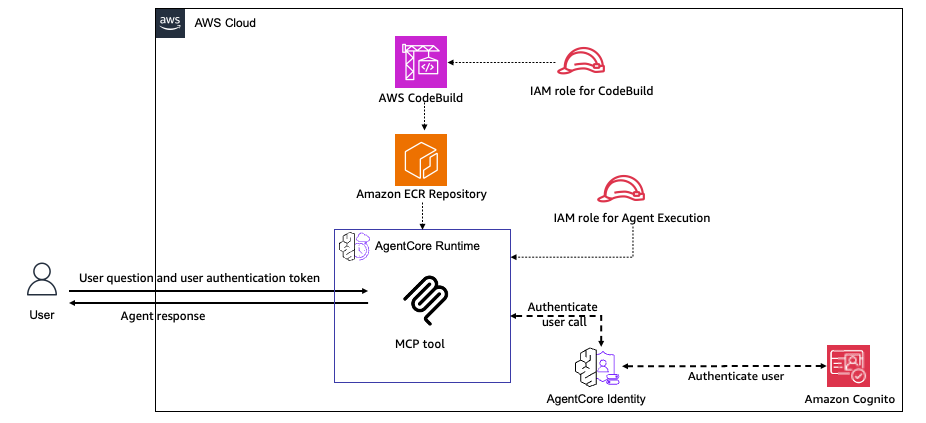

# Hosting MCP Server on AgentCore Runtime - CloudFormation

## Overview

This CloudFormation template deploys an MCP (Model Context Protocol) server on Amazon Bedrock AgentCore Runtime. It demonstrates how to host MCP tools on AgentCore Runtime using infrastructure as code, with automated deployment scripts for a streamlined experience.

The template uses the Amazon Bedrock AgentCore Python SDK to wrap agent functions as an MCP server compatible with Amazon Bedrock AgentCore. It handles the MCP server details so you can focus on your agent's core functionality.

When hosting tools, the Amazon Bedrock AgentCore Python SDK implements the [Stateless Streamable HTTP](https://modelcontextprotocol.io/specification/2025-06-18/basic/transports) transport protocol with the `MCP-Session-Id` header for session isolation. Your MCP server will be hosted on port `8000` and provide one invocation path: the `mcp-POST` endpoint.

### Tutorial Details

| Information         | Details                                                   |
|:--------------------|:----------------------------------------------------------|
| Tutorial type       | Hosting Tools                                             |
| Tool type           | MCP server                                                |
| Tutorial components | CloudFormation, AgentCore Runtime, MCP server             |
| Tutorial vertical   | Cross-vertical                                            |
| Example complexity  | Easy                                                      |
| SDK used            | Amazon BedrockAgentCore Python SDK and MCP Client         |

### Architecture



This CloudFormation template deploys a simple MCP server with 3 tools: `add_numbers`, `multiply_numbers`, and `greet_user`.

The architecture consists of:

- **User/MCP Client**: Sends requests to the MCP server with JWT authentication
- **Amazon Cognito**: Provides JWT-based authentication
  - User Pool with pre-created test user (testuser/MyPassword123!)
  - User Pool Client for application access
- **AWS CodeBuild**: Builds the ARM64 Docker container image with the MCP server
- **Amazon ECR Repository**: Stores the container image
- **AgentCore Runtime**: Hosts the MCP Server
  - **MCP Server**: Exposes three tools via HTTP transport
    - `add_numbers`: Adds two numbers
    - `multiply_numbers`: Multiplies two numbers
    - `greet_user`: Greets a user by name
  - Validates JWT tokens from Cognito
  - Processes MCP tool invocations
- **IAM Roles**: 
  - IAM role for CodeBuild (builds and pushes images)
  - IAM role for AgentCore Runtime (runtime permissions)

### Key Features

* **One-Command Deployment** - Automated scripts handle everything
* **Complete Infrastructure** - Full infrastructure as code
* **Secure by Default** - JWT authentication with Cognito
* **Automated Build** - CodeBuild creates ARM64 Docker images
* **Easy Testing** - Automated test script included
* **Simple Cleanup** - One command removes all resources

## What Gets Deployed

The CloudFormation stack creates:

- **Amazon ECR Repository** - Stores the MCP server Docker image
- **AWS CodeBuild Project** - Builds ARM64 Docker image automatically  
- **Amazon Cognito User Pool** - JWT authentication
- **Cognito User Pool Client** - Application client configuration
- **Cognito User** - Pre-created test user (testuser/MyPassword123!)
- **IAM Roles** - Least-privilege permissions for all services
- **Lambda Functions** - Custom resource automation
- **Amazon Bedrock AgentCore Runtime** - Hosts the MCP server

**MCP Server Tools**:
- `add_numbers` - Adds two numbers together
- `multiply_numbers` - Multiplies two numbers  
- `greet_user` - Greets a user by name

## Prerequisites

- AWS CLI configured with appropriate credentials
- AWS account with permissions to create:
  - CloudFormation stacks
  - ECR repositories
  - CodeBuild projects
  - Cognito User Pools
  - IAM roles and policies
  - Lambda functions
  - Bedrock AgentCore Runtime
- Python 3.8+ (for testing)
- `boto3` and `mcp` Python packages (installed automatically by test script)

## Quick Start

### 1. Deploy the Stack

```bash
cd 04-infrastructure-as-code/cloudformation/mcp-server-agentcore-runtime
./deploy.sh
```

The deployment takes approximately **10-15 minutes** and includes:
- Creating all AWS resources
- Building the Docker image
- Pushing to ECR
- Starting the AgentCore Runtime

### 2. Test the MCP Server

After deployment completes:

```bash
./test.sh
```

This will:
- Authenticate with Cognito
- Test all three MCP tools
- Display the results

### 3. Cleanup

When you're done:

```bash
./cleanup.sh
```

This removes all created resources.

## Understanding the Components

#### Authentication Flow

1. User authenticates with Cognito using username/password
2. Cognito returns an access token (JWT)
3. Access token is passed as Bearer token to AgentCore Runtime
4. AgentCore Runtime validates the token with Cognito
5. If valid, the MCP server processes the request

#### MCP Server Implementation

The MCP server is embedded in the CodeBuild buildspec and includes:

```python
from bedrock_agentcore.mcp import MCPServer

server = MCPServer()

@server.tool()
def add_numbers(a: int, b: int) -> int:
    """Add two numbers together."""
    return a + b

@server.tool()
def multiply_numbers(a: int, b: int) -> int:
    """Multiply two numbers together."""
    return a * b

@server.tool()
def greet_user(name: str) -> str:
    """Greet a user by name."""
    return f"Hello, {name}!"
```

#### Docker Image Build

CodeBuild automatically:
1. Creates a Python 3.12 ARM64 environment
2. Installs dependencies
3. Creates the MCP server code
4. Builds the Docker image
5. Pushes to ECR
6. Triggers AgentCore Runtime update


## Additional Resources

- [Amazon Bedrock AgentCore Documentation](https://docs.aws.amazon.com/bedrock/latest/userguide/agentcore.html)
- [Model Context Protocol Specification](https://modelcontextprotocol.io/)
- [CloudFormation Template Reference](https://docs.aws.amazon.com/AWSCloudFormation/latest/TemplateReference/AWS_BedrockAgentCore.html)
- [Original Tutorial](../../01-tutorials/01-AgentCore-runtime/02-hosting-MCP-server/)
- [Detailed Technical Guide](DETAILED_GUIDE.md)
