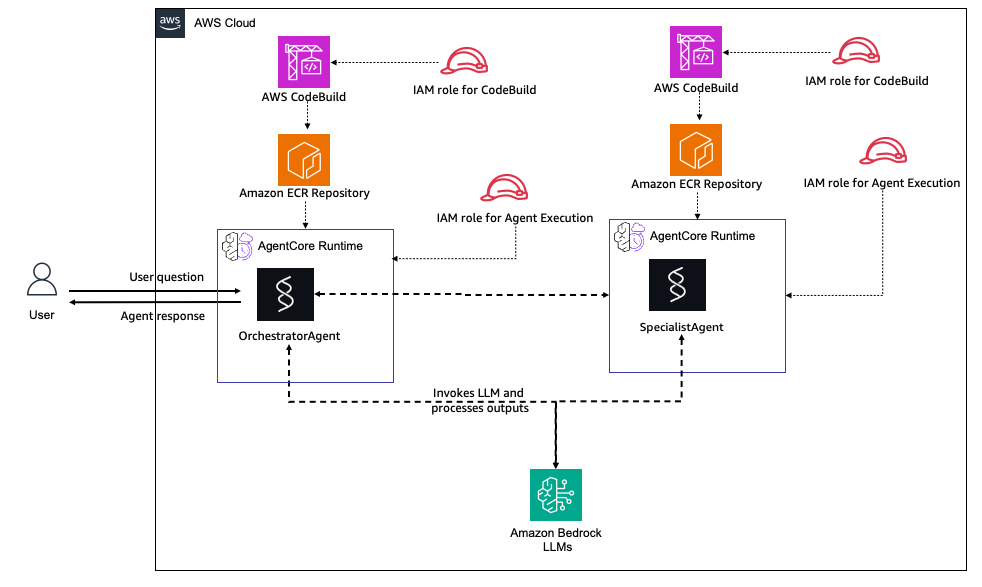

# Multi-Agent AgentCore Runtime

This CloudFormation template demonstrates a multi-agent architecture where one agent (orchestrator) can invoke another agent (specialist) to handle complex tasks. This pattern is useful for building sophisticated AI systems with specialized capabilities.

## Table of Contents

- [Overview](#overview)
- [Architecture](#architecture)
- [Prerequisites](#prerequisites)
- [Deployment](#deployment)
- [Testing](#testing)
- [Sample Queries](#sample-queries)
- [Cleanup](#cleanup)
- [Cost Estimate](#cost-estimate)
- [Troubleshooting](#troubleshooting)
- [🤝 Contributing](#-contributing)
- [📄 License](#-license)

## Overview

This template creates a two-agent system that demonstrates agent-to-agent communication:

### Agent 1: Orchestrator Agent
- **Role**: Main entry point for user queries
- **Capabilities**:
  - Handles simple queries directly
  - Delegates complex tasks to Agent 2
  - Has a tool to invoke Agent 2's runtime
- **Use Cases**: Routing, task delegation, simple Q&A

### Agent 2: Specialist Agent
- **Role**: Expert agent for detailed analysis
- **Capabilities**:
  - Provides in-depth analytical responses
  - Handles complex reasoning tasks
  - Focuses on accuracy and completeness
- **Use Cases**: Data analysis, expert knowledge, detailed explanations

### Key Features

- **Multi-Agent Communication**: Agent 1 can invoke Agent 2 using `bedrock-agentcore:InvokeAgentRuntime`
- **Automatic Orchestration**: Agent 1 decides when to delegate based on query complexity
- **Independent Deployment**: Each agent has its own ECR repository and runtime
- **Modular Architecture**: Easy to extend with additional specialized agents

## Architecture



The architecture consists of:

- **User**: Sends questions to Agent 1 (Orchestrator) and receives responses
- **Agent 1 - Orchestrator Agent**:
  - **AWS CodeBuild**: Builds the ARM64 Docker container image for Agent 1
  - **Amazon ECR Repository**: Stores Agent 1's container image
  - **AgentCore Runtime**: Hosts the Orchestrator Agent
    - Routes simple queries directly
    - Delegates complex queries to Agent 2 using the `call_specialist_agent` tool
    - Invokes Amazon Bedrock LLMs for reasoning
  - **IAM Role**: Permissions to invoke Agent 2's runtime and access Bedrock
- **Agent 2 - Specialist Agent**:
  - **AWS CodeBuild**: Builds the ARM64 Docker container image for Agent 2
  - **Amazon ECR Repository**: Stores Agent 2's container image
  - **AgentCore Runtime**: Hosts the Specialist Agent
    - Provides detailed analysis and expert responses
    - Invokes Amazon Bedrock LLMs for in-depth reasoning
  - **IAM Role**: Standard runtime permissions and Bedrock access
- **Amazon Bedrock LLMs**: Provides AI model capabilities for both agents
- **Agent-to-Agent Communication**: Agent 1 can invoke Agent 2's runtime via `bedrock-agentcore:InvokeAgentRuntime` API

## Prerequisites

### AWS Account Setup

1. **AWS Account**: You need an active AWS account with appropriate permissions
   - [Create AWS Account](https://aws.amazon.com/account/)
   - [AWS Console Access](https://aws.amazon.com/console/)

2. **AWS CLI**: Install and configure AWS CLI with your credentials
   - [Install AWS CLI](https://docs.aws.amazon.com/cli/latest/userguide/getting-started-install.html)
   - [Configure AWS CLI](https://docs.aws.amazon.com/cli/latest/userguide/cli-configure-quickstart.html)
   
   ```bash
   aws configure
   ```

3. **Bedrock Model Access**: Enable access to Amazon Bedrock models in your AWS region
   - Navigate to [Amazon Bedrock Console](https://console.aws.amazon.com/bedrock/)
   - Go to "Model access" and request access to:
     - Anthropic Claude models
   - [Bedrock Model Access Guide](https://docs.aws.amazon.com/bedrock/latest/userguide/model-access.html)

4. **Required Permissions**: Your AWS user/role needs permissions for:
   - CloudFormation stack operations
   - ECR repository management
   - IAM role creation
   - Lambda function creation
   - CodeBuild project creation
   - BedrockAgentCore resource creation

## Deployment

### Option 1: Using the Deploy Script (Recommended)

```bash
# Make the script executable
chmod +x deploy.sh

# Deploy the stack
./deploy.sh
```

The script will:
1. Deploy the CloudFormation stack
2. Wait for stack creation to complete
3. Display both Agent Runtime IDs

### Option 2: Using AWS CLI

```bash
# Deploy the stack
aws cloudformation create-stack \
  --stack-name multi-agent-demo \
  --template-body file://template.yaml \
  --capabilities CAPABILITY_NAMED_IAM \
  --region us-west-2

# Wait for stack creation
aws cloudformation wait stack-create-complete \
  --stack-name multi-agent-demo \
  --region us-west-2

# Get the Runtime IDs
aws cloudformation describe-stacks \
  --stack-name multi-agent-demo \
  --region us-west-2 \
  --query 'Stacks[0].Outputs'
```

### Option 3: Using AWS Console

1. Navigate to [CloudFormation Console](https://console.aws.amazon.com/cloudformation/)
2. Click "Create stack" → "With new resources"
3. Upload the `template.yaml` file
4. Enter stack name: `multi-agent-demo`
5. Review parameters (or use defaults)
6. Check "I acknowledge that AWS CloudFormation might create IAM resources"
7. Click "Create stack"


## Testing

### Test Agent 1 (Orchestrator)

Agent 1 is your main entry point. It will handle simple queries directly or delegate to Agent 2 for complex tasks.

#### Using AWS CLI

```bash
# Get Agent1 Runtime ID
AGENT1_ID=$(aws cloudformation describe-stacks \
  --stack-name multi-agent-demo \
  --region us-west-2 \
  --query 'Stacks[0].Outputs[?OutputKey==`Agent1RuntimeId`].OutputValue' \
  --output text)

# Test with a simple query (Agent1 handles directly)
aws bedrock-agentcore invoke-agent-runtime \
  --agent-runtime-id $AGENT1_ID \
  --qualifier DEFAULT \
  --payload '{"prompt": "Hello, how are you?"}' \
  --region us-west-2 \
  response.json

# Test with a complex query (Agent1 delegates to Agent2)
aws bedrock-agentcore invoke-agent-runtime \
  --agent-runtime-id $AGENT1_ID \
  --qualifier DEFAULT \
  --payload '{"prompt": "Provide a detailed analysis of cloud computing benefits"}' \
  --region us-west-2 \
  response.json

cat response.json
```

### Using AWS Console

1. Navigate to [Bedrock AgentCore Console](https://console.aws.amazon.com/bedrock-agentcore/)
2. Go to "Runtimes" in the left navigation
3. Find Agent1 runtime (name starts with `multi_agent_demo_OrchestratorAgent`)
4. Click on the runtime name
5. Click "Test" button
6. Enter test payload:
   ```json
   {
     "prompt": "Hello, how are you?"
   }
   ```
7. Click "Invoke"

### Test Agent 2 (Specialist) Directly

You can also test Agent 2 directly to see its specialized capabilities.

```bash
# Get Agent2 Runtime ID
AGENT2_ID=$(aws cloudformation describe-stacks \
  --stack-name multi-agent-demo \
  --region us-west-2 \
  --query 'Stacks[0].Outputs[?OutputKey==`Agent2RuntimeId`].OutputValue' \
  --output text)

# Invoke Agent2 directly
aws bedrock-agentcore invoke-agent-runtime \
  --agent-runtime-id $AGENT2_ID \
  --qualifier DEFAULT \
  --payload '{"prompt": "Explain quantum computing in detail"}' \
  --region us-west-2 \
  response.json
```

## Sample Queries

### Queries that Agent 1 Handles Directly

These simple queries don't require specialist knowledge:

1. **Greetings**:
   ```json
   {"prompt": "Hello, how are you?"}
   ```

2. **Simple Math**:
   ```json
   {"prompt": "What is 5 + 3?"}
   ```


### Queries that Trigger Agent 2 Delegation

These complex queries require expert analysis:

1. **Detailed Analysis**:
   ```json
   {"prompt": "Provide a detailed analysis of the benefits and drawbacks of serverless architecture"}
   ```

2. **Expert Knowledge**:
   ```json
   {"prompt": "Explain the CAP theorem and its implications for distributed systems"}
   ```

3. **Complex Reasoning**:
   ```json
   {"prompt": "Compare and contrast different machine learning algorithms for time series forecasting"}
   ```

4. **In-depth Explanation**:
   ```json
   {"prompt": "Provide expert analysis on best practices for securing cloud infrastructure"}
   ```

## Cleanup

### Using the Cleanup Script (Recommended)

```bash
# Make the script executable
chmod +x cleanup.sh

# Delete the stack
./cleanup.sh
```

### Using AWS CLI

```bash
aws cloudformation delete-stack \
  --stack-name multi-agent-demo \
  --region us-west-2

# Wait for deletion to complete
aws cloudformation wait stack-delete-complete \
  --stack-name multi-agent-demo \
  --region us-west-2
```

### Using AWS Console

1. Navigate to [CloudFormation Console](https://console.aws.amazon.com/cloudformation/)
2. Select the `multi-agent-demo` stack
3. Click "Delete"
4. Confirm deletion
